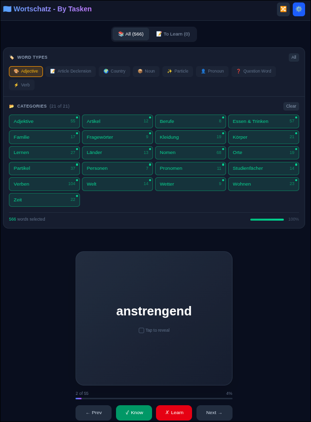

# Wortschatz - German Flashcards

Interactive flashcard app for learning German vocabulary. Built with Next.js, TypeScript, and Tailwind CSS.



## Features

- 566 words across 21 categories (nouns, verbs, adjectives, etc.)
- English translations, articles, plurals, conjugations
- Learning mode with progress tracking (localStorage)
- Category and word type filters
- Shuffle and keyboard navigation

## Installation

```bash
git clone https://github.com/yourusername/german-flashcards.git
cd german-flashcards
npm install
npm run dev
```

## Tech Stack

Next.js 16 | TypeScript | Tailwind CSS | Vercel

## Author

Eren TASKEN
